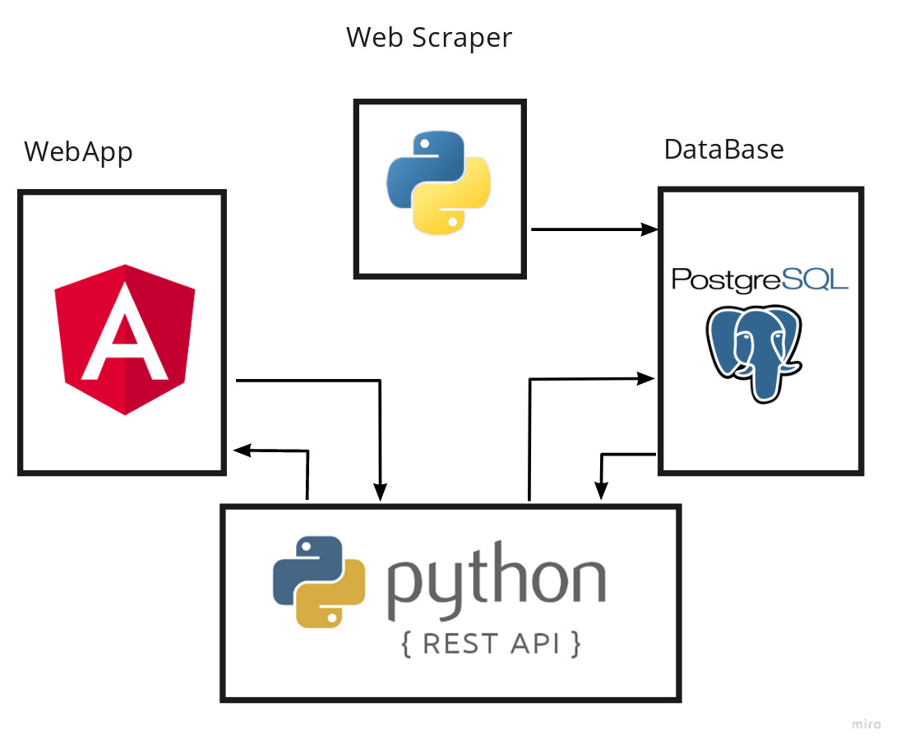
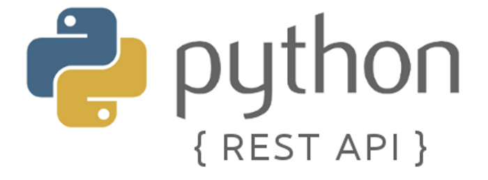
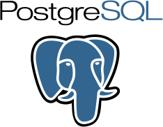

# Plano de Arquitetura

#### Histórico de revisões
|   Data   |  Versão  |        Descrição       |          Autor(es)          |
|:--------:|:--------:|:----------------------:|:---------------------------:|
|22/08/2019|   0.1    | Iniciando o documento       |  Rafael Bragança   |
|22/08/2019|   0.2    | Visão Geral       |  Rafael Bragança   |
|22/08/2019|   0.3    | WebApp      |  Rafael Bragança   |
|22/08/2019|   0.4    | API e Banco de Dados       |  Rafael Bragança   |

## 1. Visão Geral

O sistema consiste em um WebApp, uma API, um Web Scraper e um banco de dados. O Web Scraper alimentará o banco de dados com informações encontradas
na web. O WebApp fará requisições ao REST API, que por sua vez buscará os dados do banco de dados.

## 2. WebApp

Essa é a camada de interação do usuário. Através dela o usuário será capaz de buscar e adicionar dados à aplicação. Conforme o escopo do projeto e decisão da equipe, a única forma de interação do usuário será essa. Não serão desenvolvidas outras plataformas de interação para o usuário no decorrer da disciplina. Sua funcionalidade principal é requisitar/exportar informações através da  API e apresentar os dados ao usuário.

### 2.1 Tecnologias

"Angular (comumente referido como "Angular 2+" ou "Angular 2") é uma plataforma de aplicações web de código-fonte aberto e front-end baseado em TypeScript liderado pela Equipe Angular do Google e por uma comunidade de indivíduos e corporações. Angular é uma reescrita completa do AngularJS, feito pela mesma equipe que o construiu."

## 3. API

Representational State Transfer (REST) é um estilo de projeto de arquitetura de desenvolvimento web que se refere à separação lógica dos recursos da API, habilitando fácil acesso, manipulação e dimensionamento. Componentes reusáveis são escritos para sere facilmente adminitrados através de requisições HTTP simples e intuitivas, como GET, POST, PUT, PATCH e DELETE (pode ter mais, mas essas são as mais usadas).

### 3.1 Tecnologias

Para desenvolver a API, utilizaremos REST com Python e Flask Framework. O Flask segue uma abordagem de design minimalista e, portanto, tem um desempenho mais rápido em relação ao Django, por exemplo. Ele oferece aos desenvolvedores controle e flexibilidade para o desenvolvimento. Ao contrário de outros web frameworks, o Flask não tem uma camada adicional de acesso ao banco de dados nem depende do ORM (Object-Relational Mapping). Como resultado, a integração com toolkits de banco de dados é facilitada. Outro fato importante na decisão foi o conhecimento da equipe com a tecnologia, a fim de agilizar o processo de desenvolvimento do projeto.

## 4. Banco de Dados

Por enquanto, o banco de dados escolhido para o projeto é o PostgreSQL. é um sistema gerenciador de banco de dados objeto relacional (SGBD), desenvolvido como projeto de código aberto.

### 4.1 Tecnologias

O PostgreSQL é um sistema gerenciador de banco de dados objeto relacional (SGBD), desenvolvido como projeto de código aberto. As principais vantagens do PostgreSQL são:
    - o Imunidade ao fato de não ter que pagar por uma licença, muito menos para várias.
    - o Performance bastante admirável.
    - o Multi-plataforma.
    - o Altamente escalável.

### 5. Referências

[2]https://pt.wikipedia.org/wiki/Angular_(framework)
[3]https://code.tutsplus.com/pt/tutorials/building-restful-apis-with-flask-diy--cms-26625
[3]https://imasters.com.br/back-end/flask-x-django-como-escolher-o-framework-correto-para-seu-aplicativo-web
[4]https://www.educacaoetecnologia.org/artigo/2011/06/09/quais-as-vantagens-de-utilizar-postgresql/
