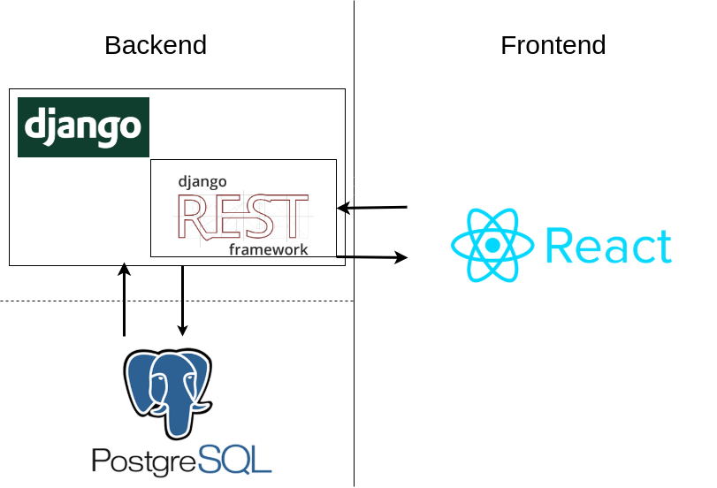

#Arquitetura

#### Histórico de revisões
|   Data   |  Versão  |        Descrição       |          Autor(es)          |
|:--------:|:--------:|:----------------------:|:---------------------------:|
|22/08/2019|   0.1    | Iniciando o documento       |  Rafael Bragança   |
|22/08/2019|   0.2    | Visão Geral       |  Rafael Bragança   |
|22/08/2019|   0.3    | WebApp      |  Rafael Bragança   |
|22/08/2019|   0.4    | API e Banco de Dados       |  Rafael Bragança   |
|07/11/2019|   0.5    | Atualizando documento em realção ao projeto | João Gabriel|

## 1. Visão Geral

Para desenvolver este projeto será utilizado o React no front-end e no back-end será utilizado Django em conjunto ao Django Rest Framework. O Django trabalha com a arquitetura MVT contudo a camanda Template será substituida pelo React. Sendo esta ligação entre DRF(Django Rest Framework)com React através do método de protocolo HTTP através da URL.

## 2. WebApp

Essa é a camada de interação do usuário. Através dela o usuário será capaz de buscar e adicionar dados à aplicação. Conforme o escopo do projeto e decisão da equipe, a única forma de interação do usuário será essa. Não serão desenvolvidas outras plataformas de interação para o usuário no decorrer da disciplina. Sua funcionalidade principal é requisitar/exportar informações através da  API e apresentar os dados ao usuário.

### 2.1 Tecnologias

"O React é uma biblioteca JavaScript de código aberto com foco em criar interfaces de usuário em páginas web. É mantido pelo Facebook, Instagram, outras empresas e uma comunidade de desenvolvedores individuais. É utilizado nos sites da Netflix, Imgur, Feedly, Airbnb, SeatGeek, HelloSign, Walmart e outros." [2]

## 3. API

Representational State Transfer (REST) é um estilo de projeto de arquitetura de desenvolvimento web que se refere à separação lógica dos recursos da API, habilitando fácil acesso, manipulação e dimensionamento. Componentes reusáveis são escritos para serem facilmente adminitrados através de requisições HTTP simples e intuitivas, como GET, POST, PUT, PATCH e DELETE (pode ter mais, mas essas são as mais usadas).

"A estrutura REST do Django é um kit de ferramentas poderoso e flexível para criar APIs da Web."[5]

### 3.1 Tecnologias

Para desenvolver a API, utilizaremos REST com Python e Django Rest Framework.O Django Rest Framework é proveniente do Django que é um Python Web Framework de alto nível possibilitando um desenvolvimento mais rápido e limpo. Trabalhando de forma singular seguindo o modelo MVT(Model - Views - Template), onde considera-se que a própria plataforma exerce o papel de Controler.

Sendo assim utilizado o Django Rest Framework para facilmente integrar Rest API às funcinalidades do Django 

## 4. Banco de Dados

Por enquanto, o banco de dados escolhido para o projeto é o PostgreSQL. é um sistema gerenciador de banco de dados objeto relacional (SGBD), desenvolvido como projeto de código aberto.

### 4.1 Tecnologias

O PostgreSQL é um sistema gerenciador de banco de dados objeto relacional (SGBD), desenvolvido como projeto de código aberto. As principais vantagens do PostgreSQL são:
    - o Imunidade ao fato de não ter que pagar por uma licença, muito menos para várias.
    - o Performance bastante admirável.
    - o Multi-plataforma.
    - o Altamente escalável.

### 5. Referências

[2] https://pt.wikipedia.org/wiki/React_(JavaScript)

[3] https://code.tutsplus.com/pt/tutorials/building-restful-apis-with-flask-diy--cms-26625

[3] https://imasters.com.br/back-end/flask-x-django-como-escolher-o-framework-correto-para-seu-aplicativo-web

[4] https://www.educacaoetecnologia.org/artigo/2011/06/09/quais-as-vantagens-de-utilizar-postgresql/

[5]https://www.django-rest-framework.org/