# Tema descontinuado

#### Histórico de revisões

|   Data   |  Versão  |        Descrição       |          Autor(es)          |
|:--------:|:--------:|:----------------------:|:---------------------------:|
|30/08/2019|   0.1    | Iniciando e adicionando o documento       |  André Lucas   |

## 1. Tema

### Visão Geral

O Estima é um projeto ser desenvolvido pelos alunos deste grupo e se trata de uma
plataforma que será capaz de auxiliar os profissionais da área de tecnologia a
estimarem, principalmente, tempo e custo de projetos de software a partir
de de um ambiente colaborativo.

### Fluxo Básico

Ao realizar login, o usuário terá acesso aos dados sobre projetos contidos no
banco de dados da aplicação. Informações como numero de integrantes da equipe,
escopo do projeto, tempo gasto na sua execução e preço cobrado estarão disponíveis
para que o usuário possa ter uma base na estimativa de seus projetos pessoais.
Ao cadastrar um projeto na plataforma, o sistema, a partir dos dados já existentes,
estimará para o usuário os pontos supracitados. Espera-se que, com a utilização da
plataforma por mais e mais usuários, a aplicação seja capaz de estimar com uma boa
precisão os custos e prazos reais do projeto em questão.

## 2. 5W2H

A 5W2H é uma ferramenta de gestão empregada no planejamento estratégico de empresas. Ela parte de uma meta para organizar as ações e determinar o que será feito para alcançá-la, por qual razão, por quem, como, quando e onde será feito, além de estimar quanto isso custará.

Em geral proposta na forma de planilha ou tabela, a metodologia costuma ser utilizada em projetos para avaliar, acompanhar e garantir que as atividades sejam executadas com clareza e excelência por todos os envolvidos.

### 2.1

**Versão 1.0**

 

### 2.2

**Versão 1.0**

|What (O que será feito?)|
|:--:|
|Uma aplicação que ajude a estimar o valor e o tempo necessário para produzir um software|
|**Why (Por que será feito?)**|
|Por não existir ferramentas assim, o que leva os desenvolvedores e empresas a "chutar" os prazos|
|**Where (Onde será feito?)**|
|Será feito na UnB-FGA e em paralelo no git|
|**When (Quando será feito?)**|
|Durante o semestre 2019/2, no periodo de aulas de Arquitetura e Desenho de Software|
|**Who (Quem fará?)**|
|Tudo será feito pelo grupo definido na máteria|
|**How (Como isso será feito?)**|
|Tecnologia a definir. Contaremos com dados inseridos pelos usuários e a partir destes dados estimar valores e prazos para nossos clientes|
|**How much (Quanto custa fazer isso?)**|
|Será feita após a definição concreta das tecnologias|

### 2.3

**Versão 1.0**

|What (O que será feito?)|
|:--:|
|Uma aplicação web que possa auxiliar a área de T.I a estimar com maior precisão custo e prazo|
|**Why (Por que será feito?)**|
|Porque existe uma dificuldade técnica na estimativa de custo e prazo em projetos de desenvolvimento de software|
|**Where (Onde será feito?)**|
|Na faculdade gama - UnB|
|**When (Quando será feito?)**|
|Durante o semestre letivo de 2019/2|
|**Who (Quem fará?)**|
|Alunos integrantes do grupo Estima|
|**How (Como isso será feito?)**|
|Através da aplicação de conhecimento nas tecnologias de desenvolvimento de software|
|**How much (Quanto custa fazer isso?)**|
|De maneira teórica, nada. Os custos adjacentes com gasolina, alimentação, reuniões e demais não podem ser calculados no momento. |

### 2.4

**Versão 1.0**

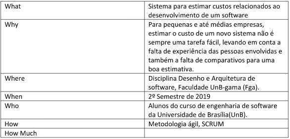 

### 2.5

**Versão 1.0**

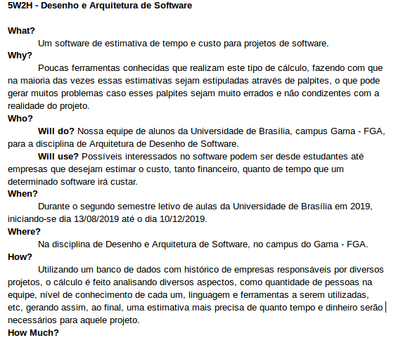 

### 2.6

**Versão 1.0**

[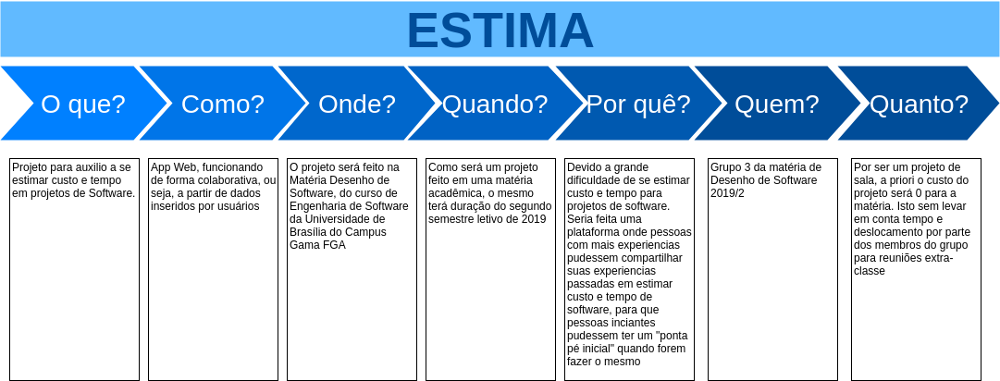](img/5W2HJoaoSaliba.png) 

## 3. Diagrama Causa-Efeito

O Diagrama de Ishikawa, também conhecido como Diagrama de Causa e Efeito ou Diagrama Espinha de peixe[1], é um gráfico cuja finalidade é organizar o raciocínio em discussões de um problema prioritário, em processos diversos, especialmente na produção industrial. Esta técnica é utilizada para descobrir, organizar e resumir conhecimento de um grupo a respeito das possíveis causas que contribuem para um determinado efeito.

### 3.1 Entrada de dados pelo usuário

 

### 3.2 Dificuldades de implementação

[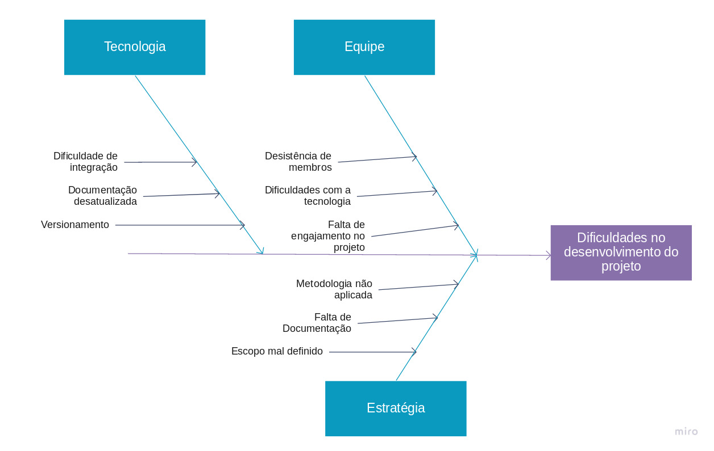](img/fishBoneRafaelComplicacoes.jpg) 

## 4. Mapa Mental

Mapa mental é um diagrama que permite que você organize ideias de forma simples e lógica, representando-as visualmente, facilitando o processo de memorização. Ele começa com um tema central, que evolui através de linhas ou “ramos” relacionando os subtópicos do tema.

### 4.1 Mapa Mental: Conteúdo da aplicação.

Mapa mental que contempla o conteúdo foco da aplicação, que seria a coleta e compartilhamento de dados referentes a desenvolvimento de software, como os custos, tempo, gestão de pessoal e tecnologias utilizadas no desenvolvimento desde projetos inteiros até uma simples feature.

**Versão 1.0**

 

### 4.2 Mapa Mental

**Versão 1.0**

 

### 4.3 Mapa Mental

**Versão 1.0**

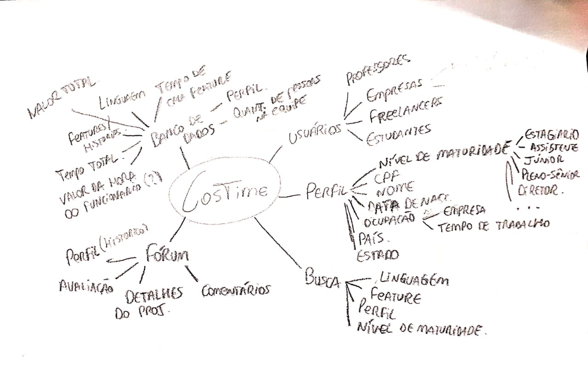

### 4.4 Mapa Mental

**Versão 1.0**

[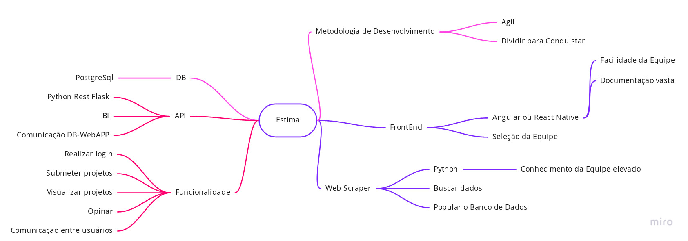](img/mapaMentalRafael.jpg)

### 4.5 Mapa Mental

**Versão 1.0**

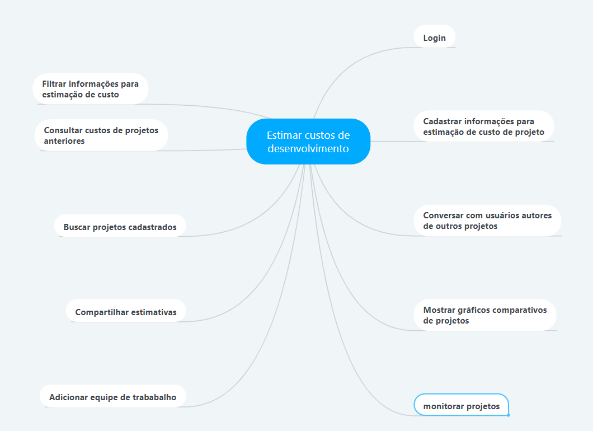

### 4.6 Mapa Mental

**Versão 1.0**

## 5. Rich Picture

O Rich Picture fornece um mecanismo para aprender sobre problemas complexos ou
mal definidos, desenhando representações detalhadas ("ricas") deles.
Normalmente, as imagens ricas não seguem uma sintaxe comum,
geralmente consistem em símbolos, esboços ou "rabiscos" e podem conter tanta
informação (pictórica) quanto for considerado necessário.

Também é possível produzir Rich Picture como parte de um grupo. Ao fazer
com que todos contribuam para um quadro rico, eles podem ser usados ​​para
ajudar a desenvolver uma compreensão compartilhada de uma determinada situação.

**Versão 1**

### 5.1

**Versão 1**

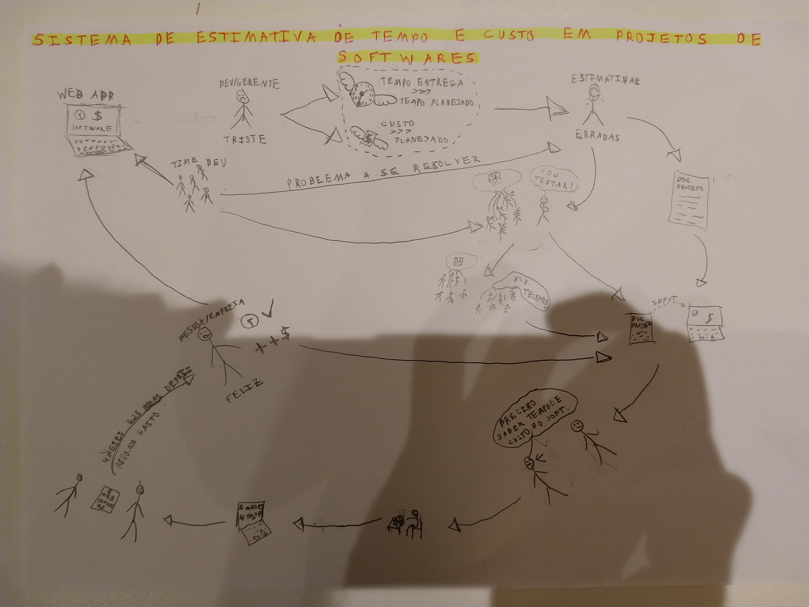 

### 5.2

**Versão 1**

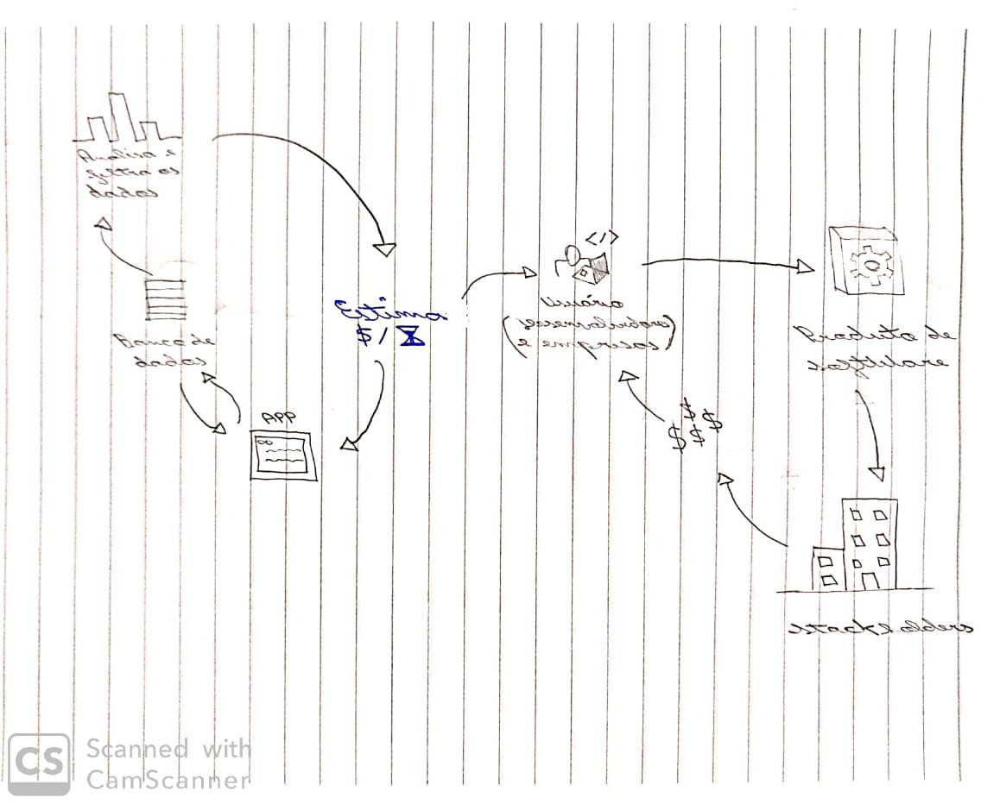 

### 5.3

**Versão 1**

 
Autor: Caio César Beleza

**Versão 2**

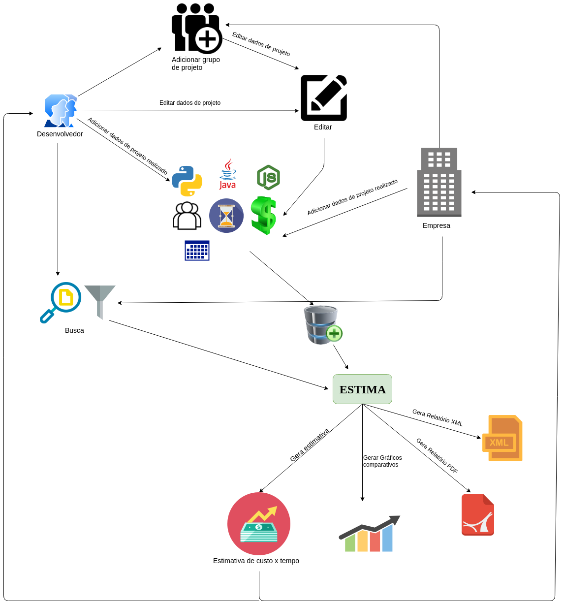 
Autor: Caio César Beleza

### 5.4

**Versão 1**

 

**Versão 2**

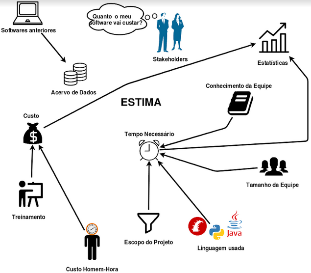 

### 5.5

**Versão 1**

[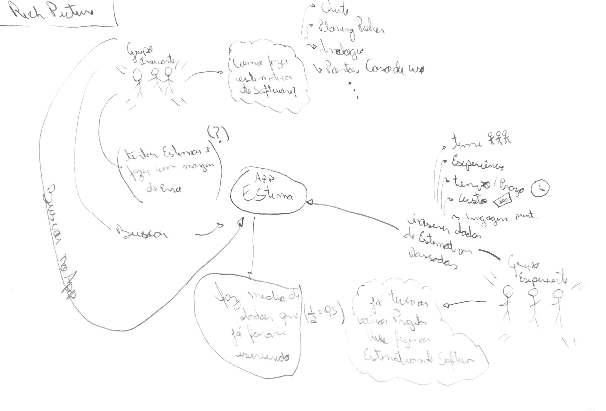](img/RichPictureJoaoSaliba.png) 

## 6. Conclusão

Devido a falta de interação do grupo com o tema decidimos por meio de votação escolher outro tema. Também levamos em conta a dependência que teriamos de dados inseridos pelos usuários para que o projeto desse resultado. Veja o [tema atual](../tema/) escolhido pelo grupo.

## 7. Referências

[1] Aula 02 de Arquitetura e Desenho de Software da UnB-Gama - Prof: Milene Serrano

[2] ROCHA, Hugo. 5W2H: o que significa, para que serve, como fazer e exemplos. Disponível em https://klickpages.com.br/blog/5w2h-o-que-significa/

[3] https://pt.wikipedia.org/wiki/Diagrama_de_Ishikawa

[4] AMORIM, Rebeca. Como fazer um mapa mental. Disponível em https://geekiegames.geekie.com.br/blog/como-fazer-um-mapa-mental/

[5] https://en.wikipedia.org/wiki/Rich_picture
