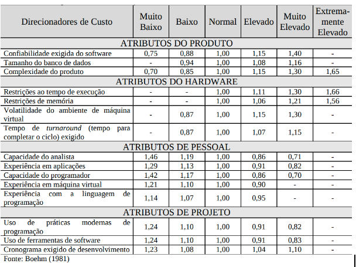
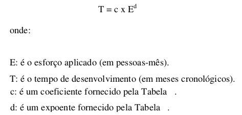

# Modelo de Custo Produtivo

## 1. Introdução

O modelo de Custo produtivo aplicado neste projeto será o COCOMO( ou Constructive Cost Model), em que é utilizado para esticar custo e tempo de software, que foi baseado em uma hierarquia de modelos de software. Sendo implementado:

**COCOMO Básico (basic):** computa esforço para desenvolver o software e seu custo em relação a quantidade de linhas de código.

**COCOMO Intermediário (Intermediate):** computa o esforço e o custo de desenvolvimento considerando uma estimativa do tamanho do programa e um conjunto de direcionadores de custo (avaliações subjetivas do produto, do hardware, do pessoal e dos atributos do projeto).  

**COCOMO Detalhado (Detailed):** incorpora as características do COCOMO Intermediário, e além disso inclui uma avaliação do  impacto dos direcionadores de custo sobre cada etapa do desenvolvimento

O projeto possuindo características da classe de Modo Semidestacado, onde o mesmo é um projeto intermediário, além da equipe ser formada por desenvolvedores com níveis de experiência mista. Sendo assim, será aplicada o  COCOMO Intermediário.

## 2. Modelo de Custo Produtivo Intermediário 

Por se tratar de ser um refinamento do modelo COCOMO Básico, o modelo COCOMO intermediário será utilizado neste projeto, levando em contas os multiplicadores de esforço de cada direcionador indicado nas tabelas abaixo chegaremos a uma estimativa de esforço e tempo.

No modelo de Custo Produtivo Intermediário, é ampliado o COCOMO Básico com a finalidade de levar em consideração um conjunto de atributos direcionadores do custo que são agrupados em quatro categorias, sendo elas:

### 1.Atributos do produto
* confiabilidade exigida do software;
* tamanho do banco de dados;
* complexidade do produto;
### 2. Atributos do hardware
* restrições ao tempo de execução;
* restrições de memórias;
* volatilidade do ambiente de máquina virtual;
* tempo de turnarounde(tempo para completar o ciclo) exigido.
### 3. Atributos de pessoal
* capacidade do analista
* experiência em aplicações
* capacidade do programador
* experiência em maquina virtual
* experiência com a linguagem de programação
### 4. Atributos de projeto
* uso de práticas modernas de programação
* uso de ferramentas de software
* cronograma exigido no desenvolvimento

Cada atributo deve ser classificado de acordo com a tabela a seguir. Onde a partir da mesma determina-se o Multiplicador do Esforço, onde o produto de todos os  multiplicadores de esforço é chamado de Fator de ajustamento do Esforço (PRESSMAN, 1995).

 

Usa-se a equação a seguir no modelo COCOMO Intermediário para a estimativa de esforço:

 

Para Boehm (1981) os valores do coeficiente “a” e do expoente “b” do modelo COCOMO Intermediário são apresentados na tabela a seguir:

 

#### Cálculo da estimativa de tempo (MÊS)
O cálculo para estimativa de tempo utiliza a seguinte equação:

 

## 3. Resultados 
 
#### Estimativa de Tamanho
Levando em conta que a média de Linhas de Codigo produzidas durante a matéria gira em torno de 4000 linhas, e este projeta assemelha-se a projetos já executados, levaremos em conta que serão feitas 4000 linhas de codigo (LoC)
 
 S = 4500 LoC ou S  =4,5kLoC

#### Estimativa de Esforço
 Para se calcular a estimativa de esforço é necessário  a estimativa de tamanho e substituir na seguinte formula:
  
  E = a * S^b * fae
  Logo teremos:

   E = 3 * 4^1,12 * 0,89

   E= 11,76 pessoas/mês

#### Estimativa de tempo

 T = c * E^d
 T = 2,5 * 11,76 ^0,35
 T = 5,92 meses

## 4. Referências
[1] Meller, Maristela Corrêa. Modelos Para Estimar Custos De Software: Estudo Comparativo Com Softwares De Pequeno Porte. 2002. 
