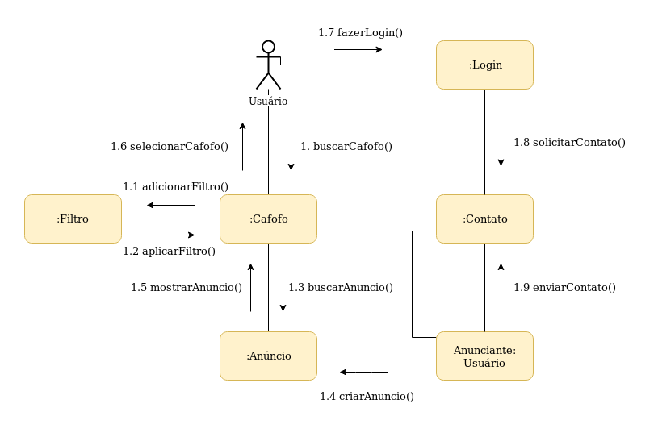
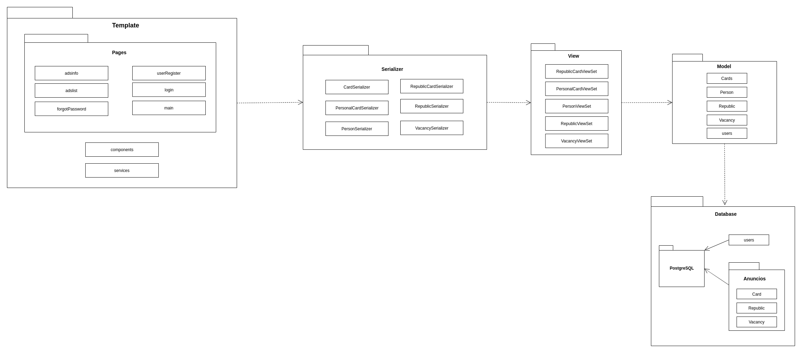

# Documento de Arquitetura de Software

#### Histórico de revisões
|    Data    | Versão |       Descrição       |    Autor(es)     |
| :--------: | :----: | :-------------------: | :--------------: |
| 04/11/2019 | 0.1 | Iniciando o documento e adicionando o Sumário | Weiller Fernandes |
| 04/11/2019 | 0.2 | Adicionando Objetivo e Escopo | Weiller Fernandes |
| 09/11/2019 | 0.3 | Adicionando Metas e Restrições | Caio César Beleza |
| 09/11/2019 | 0.4 | Adicionando Visão de Casos de Uso | Caio César Beleza |
| 09/11/2019 | 0.5 | Adicionando Visão Lógica geral | Caio César Beleza |
| 09/11/2019 | 0.6 | Adicionando Definições, Acrônimos e Abreviações e Visão Geral | João Gabriel |
| 12/11/2019 | 0.7 | Adicionando Diagrama de Pacotes versão 1.0 | Caio César Beleza |
| 12/11/2019 | 0.8 | Adicionando Diagrama de Pacotes versão 2.0 | Caio César Beleza |
| 12/11/2019 | 0.9 | Adicionando Diagrama de Colaboração | Weiller Fernandes |
| 12/11/2019 | 1.0 | Adicionando Descrição de Diagrama de Pacotes | Caio César Beleza |
| 13/11/2019 | 1.1 | Iniciando Visão de Implementação | Caio César Beleza |
| 13/11/2019 | 1.2 | Correção do tópico Definições, Acrônimos e Abreviações | Weiller Fernandes |
| 13/11/2019 | 1.3 | Correção da descrição do Diagrama de Colaboração | Weiller Fernandes |
| 13/11/2019 | 1.4 | Adicionando tópico Qualidade | Weiller Fernandes |
| 13/11/2019 | 1.5 | Iniciando Visão de Implantação e adicionando diagrama | Caio César Beleza |

## Sumário
  - [1. Introdução](#1-introducao)
    - [1.1 Objetivo](#11-objetivo)
    - [1.2 Escopo](#12-escopo)
    - [1.3 Definições, Acrônimos e Abreviações](#13-definicoes-acronimos-e-abreviacoes)
    - [1.4 Referências](#14-referencias)
    - [1.5 Visão Geral](#15-visao-geral)
  - [2. Representação Arquitetural](#2-representacao-arquitetural)
  - [3. Restrições e Metas Arquiteturais](#3-restricoes-e-metas-arquiteturais)
  - [4. Visão de Casos de Uso](#4-visao-de-casos-de-uso)
  - [5. Visão Lógica](#5-visao-logica)
  - [6. Visão de Processo](#6-visao-de-processo)
  - [7. Visão de Implementação](#7-visao-de-implementacao)
  - [8. Visão de Implantação](#8-visao-de-implantacao)
  - [9. Visão de dados](#9-visao-de-dados)
  - [10. Tamanho e Desempenho](#10-tamanho-e-desempenho)
  - [11. Qualidade](#11-qualidade)

## 1. Introdução

### 1.1 Objetivo

Este documento apresenta a arquitetura proposta para o projeto Cafofo, realizado na disciplina de Desenho de Software no segundo semestre de 2019. Com o objetivo de capturar e formalizar as principais decisões tomadas com relação à arquitetura do sistema e fornecer uma visão arquitetural abrangente deste, fazendo uso de diversas visões para representar diferentes aspectos das aplicação.

### 1.2 Escopo

O projeto Cafofo tem como principal objetivo auxiliar alunos de uma Universidade, sejam eles calouros ou veteranos, a encontrarem um local para alugar, república ou casa, visto que é bastante comum as Universidades receberem alunos vindos de outros estados e países e esses tem dificuldade para encontrar um lugar para ficar que seja próximo a faculdade e atenda seus objetivos. Portanto, as principais funcionalidades do Cafofo são:

- Buscar moradias que tenham o foco em receber estudantes universitários.
- Anunciar casas/repúblicas para aluguel.
- Editar ou excluir anúncios existentes.
- Filtrar os anúncios de acordo com suas preferências.
- Entrar em contato com o anunciante, através de link para o whatsapp, para concretizar o aluguel.

### 1.3 Definições, Acrônimos e Abreviações
* DAS: Documento de Arquitetura de Software
* DRF: Django Rest Framework
* API: Application Programming Interface (Interface de Programação de Aplicativos)
* REST: Representational State Transfer (Transferência de Estado Representacional)
* HTTP: Hypertext Transfer Protocol (Protocolo de Transferência de Hipertexto)
* App: Application (Aplicativo)
* MVC: Model-View-Controller
* MVT: Model-View-Template
* UC: Use Case (Caso de Uso)
* UML: Unified Modeling Language
* URL: Uniform Resource Locator (Localizador Uniforme de Recursos)
* SGBD: Sistema de Gestão de Base de Dados

### 1.4 Referências

- [DAS Template](http://sce.uhcl.edu/helm/RationalUnifiedProcess/webtmpl/templates/a_and_d/rup_sad.htm)
- [React](https://pt.wikipedia.org/wiki/React_(JavaScript))
- [DRF](https://www.django-rest-framework.org/)
- [Postgres](https://www.educacaoetecnologia.org/artigo/2011/06/09/quais-as-vantagens-de-utilizar-postgresql/)
- [Diagrama de Pacotes](https://micreiros.com/diagrama-de-pacotes/)

### 1.5 Visão Geral
Neste documentos iremos detalhar as soluções de arquiteturar aplicadas neste projeto. Seguindo os seguitnes tópicos:

* Representação Arquitetural
* Restrições e Metas Arquiteturais
* Visão de Casos de Uso
* Visão Lógica
* Visão de Processos
* Visualização da Implementação
* Visão de Dados
* Tamanho e Desempenho
* Qualidade

## 2. Representação Arquitetural

## 2.1. Visão Geral

Para desenvolver este projeto será utilizado o React no front-end e no back-end será utilizado Django em conjunto ao Django Rest Framework. O Django trabalha com a arquitetura MVT contudo a camanda Template será substituida pelo React. Sendo esta ligação entre DRF(Django Rest Framework)com React através do método de protocolo HTTP através da URL.

## 2.2. WebApp

Essa é a camada de interação do usuário. Através dela o usuário será capaz de buscar e adicionar dados à aplicação. Conforme o escopo do projeto e decisão da equipe, a única forma de interação do usuário será essa. Não serão desenvolvidas outras plataformas de interação para o usuário no decorrer da disciplina. Sua funcionalidade principal é requisitar/exportar informações através da  API e apresentar os dados ao usuário.

### 2.2.1 Tecnologias

"O React é uma biblioteca JavaScript de código aberto com foco em criar interfaces de usuário em páginas web. É mantido pelo Facebook, Instagram, outras empresas e uma comunidade de desenvolvedores individuais. É utilizado nos sites da Netflix, Imgur, Feedly, Airbnb, SeatGeek, HelloSign, Walmart e outros." [2]

## 2.3. API

Representational State Transfer (REST) é um estilo de projeto de arquitetura de desenvolvimento web que se refere à separação lógica dos recursos da API, habilitando fácil acesso, manipulação e dimensionamento. Componentes reusáveis são escritos para serem facilmente adminitrados através de requisições HTTP simples e intuitivas, como GET, POST, PUT, PATCH e DELETE (pode ter mais, mas essas são as mais usadas).

"A estrutura REST do Django é um kit de ferramentas poderoso e flexível para criar APIs da Web."[5]

### 2.4. DRF

Para desenvolver a API, utilizaremos REST com Python e Django Rest Framework. O Django Rest Framework é proveniente do Django que é um Python Web Framework de alto nível possibilitando um desenvolvimento mais rápido e limpo. Trabalhando de forma singular seguindo o modelo MVT(Model - Views - Template), onde considera-se que a própria plataforma exerce o papel de Controler.

Sendo assim utilizado o Django Rest Framework para facilmente integrar Rest API às funcinalidades do Django

## 2.5. Banco de Dados

O PostgreSQL é um sistema gerenciador de banco de dados objeto relacional (SGBD), desenvolvido como projeto de código aberto. As principais vantagens do PostgreSQL são:
  - Imunidade ao fato de não ter que pagar por uma licença, muito menos para várias.
  - Performance bastante admirável.
  - Multi-plataforma.
  - Altamente escalável.

## 3. Restrições e Metas Arquiteturais

### 3.1 Restrições
As restrições para o projeto Cafofo são as seguintes:
- Para utilizar a aplicação é preciso ter conexão com a internet;

- A aplicação será suportada apenas por Web browsers, tais como Google Chrome e Mozilla Firefox;

- Para a API, será utilizado o framework Django versão 2.1, baseado na linguagem de programação Python, que será utilizada na versão 3.6.

- Para o Front end, será utilizado React, na versão 16.10.1, que é uma biblioteca JavaScript;
- A versão do Docker utilizada é 18.09.7 e Docker-compose 1.21.2;

- A equipe possui 8 integrantes;

- Tempo limitado à aproximadamente 4 meses, que é o tempo de duração da disciplina.

### 3.2 Metas
- A aplicação deve ser desenvolvida de tal maneira que seja de fácil manutenibilidade;

- A aplicação deve estar pronta para ser apresentada ao final da disciplina;

## 4. Visão de Casos de Uso
### 4.1 Atores

|    Atores    |       Descrição       |
| :--------:   |:-------------------:  |
| Usuário   |  Quem irá utilizar a plataforma, pessoas que desejam encontrar e/ou anunciar vagas em Cafofos.                  |
| Visitante | Pessoas que não são cadastradas, só podem fazer a pesquisa de Cafofos|
| Cafofo       | Responsável por conectar os usuários às vagas ofertadas.                      |

### 4.2 Diagrama de Casos de uso

### 4.3 Descrição dos casos de Uso

| Caso de Uso | Descrição |
| :-------:   | :-------: |
| UC01 - Cadastro    | O usuário se cadastra na aplicação        |
| UC02 - Criar anuncio de Cafofo| O usuário anuncia uma vaga em algum Cafofo |
| UC03 - Buscar Cafofo | O usuário busca uma vaga em um Cafofo|
| UC04 - Avaliar Cafofo| O usuário faz uma avaliação sobre um cafofo onde tenha se hospedado|
| UC05 - Conversar com anunciante| O usuário pode tirar dúvidas sobre o cafofo com o anunciante|

## 5. Visão Lógica
### 5.1 Visão geral

O framework Django utiliza a arquitetura MVT(Model, View, Template), que é uma variação de padrão MVC, onde a camada Controller é substituída pela camada View e é acionada a camada de Template, que é a camada de apresentação que será visualizada pelo usuário.

- **Models** 
  As models são as classes que representam os dados, e são responsáveis pela manutenção desses dados. 

- **Views** 
  A view é responsável por formatar os dados das Models. Ela se comunica com o banco de dados e transfere os dados para o template, onde serão visualizados.
  

- **Templates**   
  Templates consistem na camada estática que o usuário irá interagir.

  No caso deste projeto, esta camada será representada com a biblioteca de JavaScript, React.

- **Banco de Dados**   
  Além da arquitetura tradicional do django, o projeto Cafofo terá um banco de dados em PostgreSQL, para o armazenamento dos dados de usuários e dos anuncios de Cafofos.

#### 5.1.1 Diagrama de Colaboração

Com esse diagrama podemos ver as funcionalidades dos principais elementos do software, mostrando a Colaboração dinâmica entre os objetos com ênfase no contexto do sistema.

### 5.2 Pacotes Significativos para a Visão de Arquitetural
#### 5.2.1 Diagrama de Pacotes
  O diagrama de pacotes é um conceito definido pela UML como um mecanismo de agrupamento genérico, utilizado para dividir um software grande e complexo em partes menores, para que seja mais fácil o entendimento de quem irá contribuir com ele, além de tornar mais prática a manutenção do mesmo. Essas partes menores interagem entre si.

  **Versão 1.0**
  

  **Versão 2.0**
  

## 6. Visão de Processo

## 7. Visão de Implementação
### 7.1 Visão geral
  O padrão arquitetural utilizado no projeto Cafofo é o padrão MVT com Rest framework, que foi dividido em duas camadas.

  A API, feita em Django, e utilizando o Rest Framework, é composto em três camadas: Model, View e Serializer.

  O Front end, foi feito com o React e representa o Template do projeto, que é a camada com a qual o usuário interage.

#### 7.1.1 API
- **Model** 
  O Cafofo apresenta na camada Model, os dados de usuários, anuncios e vagas que são persistidos.

- **View** 
  A view controla o fluxo de informações entre a model e o template da aplicação. É a camada que contém a lógica por trás das informações que serão extraídas e exibidas ao usuário.

- **Serializer** 
  Os serializers permitem a conversão de dados em dados nativos do python, o que facilita a renderização de arquivos. São utilizados no projeto para facilitar a comunicação da API com o Front end.

#### 7.1.2 WebApp

## 8. Visão de Implantação
O diagrama a seguir mostra como os nós físicos do sistema se comunicam.
  **Versão 1.0**
  

## 9. Visão de dados

## 10. Tamanho e Desempenho

## 11. Qualidade

Os padrões arquiteturais utilizados no projeto Cafofo contribuem fortemente para a escalabilidade e para a manutenabilidade da aplicação, como o facade por exemplo, presente tanto no back end quanto no front end, que ao ser aplicado reduz a complexidade ao mesmo tempo em que produz uma interface simplificada e reduz o acoplamento entre as camadas do projeto.
