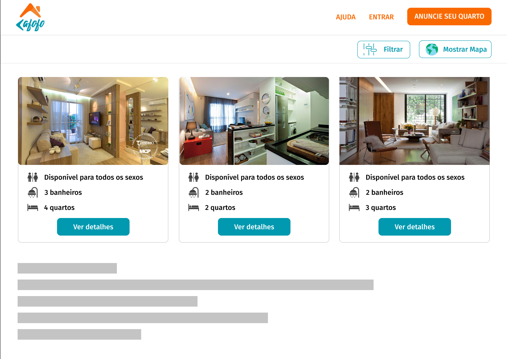

# Protótipo

#### Histórico de revisões
|   Data   |  Versão  |        Descrição       |          Autor(es)          |
|:--------:|:--------:|:----------------------:|:---------------------------:|
|29/08/2019|1.0| Iniciando o documento e adicionando protótipos |André Lucas|
|25/10/2019|1.1| Adicionando protótipo de criação de anúncio | Weiller Fernandes|

## 1. Introdução

Um protótipo de alta fidelidade deve se aproximar ao máximo dos aspectos visuais e funcionais do produto final, incluindo o conteúdo, fluxo de navegação e interações. São muito utilizados para testes e validação com usuários, ou para vender uma ideia, pois ver o produto “funcionando” costuma gerar fascinação.

## 2. Protótipo de alta fidelidade

O protótipo de alta fidelidade foi desenvolvido com a ferramenta **Figma**. Acesse este link para utilizar o protótipo interativo: [Protótipo Cafofo](https://www.figma.com/proto/SsUPDvbFgXWbtPS6fDBbqx/Cafofo?node-id=3%3A2&scaling=scale-down).

### 2.1 Tela inicial

### 2.2 Login

### 2.3 Resultados de pesquisa

Autor: André Lucas

### 2.4 Criar anúncio

Autor: Weiller Fernandes

## 3. Referências

- [Conheça os tipos de protótipos.](https://dextra.com.br/pt/baixa-media-ou-alta-fidelidade-conheca-as-diferencas-entre-os-tipos-de-prototipos/)
